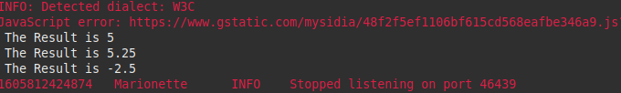

# Selenium-WebDriver

Selenium es un entorno de pruebas que se utiliza para comprobar si el software que se está desarrollando funciona correctamente. Esta herramienta permite: grabar, editar y depurar casos de pruebas que se pueden automatizar.

Lo interesante de Selenium es que se pueden editar acciones o crearlas desde cero. También ayuda mucho en las pruebas de regresión porque consigue pruebas automatizadas que luego se pueden reutilizar cuando se necesite.

## Casos de prueba 
- <b> Caso 1: Calcular el 10% de 50</b> <br>
   Entradas = 10% y 50 <br>
   Proceso = <br>
   - Hacer click en la casilla para ingresar porcentaje e ingresar 10.
   - Hacer click en la casilla del valor a calcular e ingresar 50. <br>
   <p>Resultado Esperado = 5</p>
   
- <b> Caso 1: Calcular el 10.5% de 50</b> <br>
   Entradas = 10.5 y 50 <br>
   Proceso = 
   - Hacer click en la casilla para ingresar porcentaje e ingresar 10.5.
   - Hacer click en la casilla del valor a calcular e ingresar 50. <br>
   <p>Resultado Esperado = 5.25</p>

- <b> Caso 1: Calcular el -5% de 50</b> <br>
   Entradas = -5 y 50 <br>
   Proceso =
   - Hacer click en la casilla para ingresar porcentaje e ingresar -5.
   - Hacer click en la casilla del valor a calcular e ingresar 50. <br>
   <p>Resultado Esperado = -2.5 </p>

## Creación del proyecto
Se crea un proyecyo java en un IDE, luego se pasa a agregar los JAR's que fueron descargados de la pagina web de Selenium.


## Creacion del script 

``` java
import java.util.concurrent.TimeUnit;

import org.openqa.selenium.*;
import org.openqa.selenium.firefox.FirefoxDriver;

public class webdriverdemo {
   public static void main(String[] args) {

      WebDriver driver = new FirefoxDriver();
      //Puts an Implicit wait, Will wait for 10 seconds before throwing exception
      driver.manage().timeouts().implicitlyWait(10, TimeUnit.SECONDS);

      //Launch website
      driver.navigate().to("http://www.calculator.net/");

      //Maximize the browser
      driver.manage().window().maximize();

      // Click on Math Calculators
      driver.findElement(By.xpath("/html/body/div[4]/div/table/tbody/tr/td[3]/div[2]/a")).click();

      // Click on Percent Calculators
      driver.findElement(By.xpath("/html/body/div[3]/div[1]/table[2]/tbody/tr/td/div[3]/a")).click();

      driver.findElement(By.id("cpar2")).sendKeys("50");

      String[] tests={"10","10.5","-5","a"};
      String[] resultArray= {};

      for(int i=0;i<tests.length-1;i++)
      {
      driver.findElement(By.id("cpar1")).sendKeys(tests[i]);
        driver.findElement(By.xpath("/html/body/div[3]/div[1]/table[1]/tbody/tr[2]/td/input[2]")).click();
        String result = driver.findElement(By.xpath("/html/body/div[3]/div[1]/p[2]/font/b")).getText();
        System.out.println(" The Result is " + result);
        resultArray = ArrayUtils.add(resultArray,result);
        driver.findElement(By.id("cpar1")).clear();

      }
      driver.close();
   }
}
```
## Configurar GeckoDriver 
Para usar GeckoDriver se puede tiene que descargar la version para el navegador que se quiere usar y agregarlo como variable de entorno en el sistema operativo o ingresar la ruta del ejecutable al momento de declararlo en el codigo.
```java
System.setProperty("webdriver.gecko.driver","/home/hermogenes/eclipse-workspace/WebDriverDemo/geckodriver");
```

## Pruebas
Se procede a ejecutar como una aplicación java. Al momento de la ejecución se abrirá el navegador para el cual configuramos nuestro proyecto y re realizarán las pruebas.



