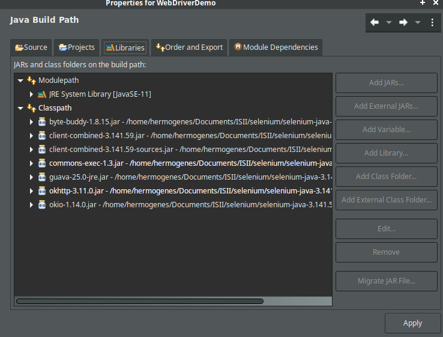
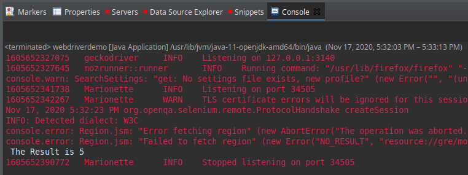
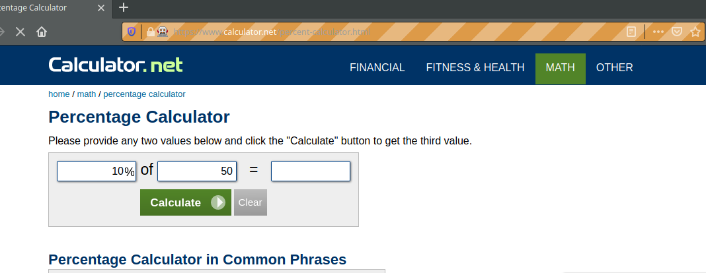

# Selenium-WebDriver

Selenium es un entorno de pruebas que se utiliza para comprobar si el software que se está desarrollando funciona correctamente. Esta herramienta permite: grabar, editar y depurar casos de pruebas que se pueden automatizar.

Lo interesante de Selenium es que se pueden editar acciones o crearlas desde cero. También ayuda mucho en las pruebas de regresión porque consigue pruebas automatizadas que luego se pueden reutilizar cuando se necesite.


## Creación del proyecto
Se crea un proyecyo java en un IDE, luego se pasa a agregar los JAR's que fueron descargados de la pagina web de Selenium.





## Creacion del script 

``` java
import java.util.concurrent.TimeUnit;

import org.openqa.selenium.*;
import org.openqa.selenium.firefox.FirefoxDriver;

public class webdriverdemo {
   public static void main(String[] args) {
   
      WebDriver driver = new FirefoxDriver();
      //Puts an Implicit wait, Will wait for 10 seconds before throwing exception
      driver.manage().timeouts().implicitlyWait(10, TimeUnit.SECONDS);
      
      //Launch website
      driver.navigate().to("http://www.calculator.net/");
      
      //Maximize the browser
      driver.manage().window().maximize();
      
      // Click on Math Calculators
      driver.findElement(By.xpath("/html/body/div[4]/div/table/tbody/tr/td[3]/div[2]/a")).click();
      
      // Click on Percent Calculators
      driver.findElement(By.xpath("/html/body/div[3]/div[1]/table[2]/tbody/tr/td/div[3]/a")).click();
      
      // Enter value 10 in the first number of the percent Calculator
      driver.findElement(By.id("cpar1")).sendKeys("10");
      
      // Enter value 50 in the second number of the percent Calculator
      driver.findElement(By.id("cpar2")).sendKeys("50");
      
      // Click Calculate Button
      driver.findElement(By.xpath("/html/body/div[3]/div[1]/table[1]/tbody/tr[2]/td/input[2]")).click();
      
      // Get the Result Text based on its xpath
      String result =
         driver.findElement(By.xpath("/html/body/div[3]/div[1]/p[2]/font/b")).getText();

      // Print a Log In message to the screen
      System.out.println(" The Result is " + result);
      
      //Close the Browser.
      driver.close();
   }
}
```
## Configurar GeckoDriver 
Para usar GeckoDriver se puede tiene que descargar la version para el navegador que se quiere usar y agregarlo como variable de entorno en el sistema operativo o ingresar la ruta del ejecutable al momento de declararlo en el codigo.
```java
System.setProperty("webdriver.gecko.driver","/home/hermogenes/eclipse-workspace/WebDriverDemo/geckodriver");
```

## Pruebas
Se procede a ejecutar como una aplicación java. Al momento de la ejecución se abrirá el navegador para el cual configuramos nuestro proyecto y re realizarán las pruebas.




